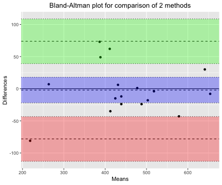
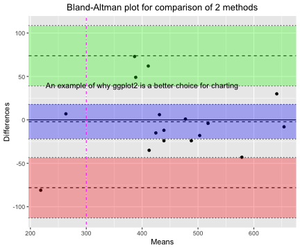
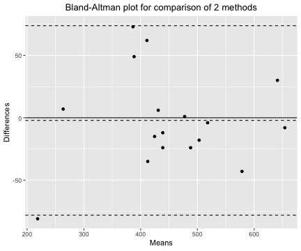
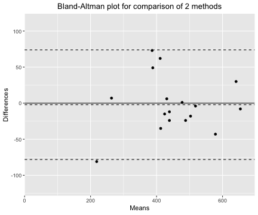
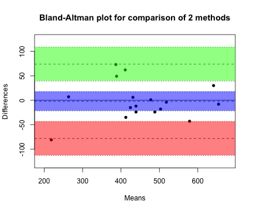

## blandr - about the package

*blandr* is a package to carry out Bland Altman analyses (also known as a Tukey mean-difference plot) in R. This package was started in 2015 as existing Bland-Altman R functions did not calculate confidence intervals: my belief is when that drawing Bland-Altman plots, confidence intervals should be considered the gold-standard. *blandr* fills this need!

*blandr* further generates plotting data to allow easy generation of charts using ggplot, as well as R's in-built drawing capabilities.

This manual functions as a series of vignettes to instruct on how to best use the functions. Further details can be gleaned for the auto-generated descriptions for each function. Some functions aren't meant to be used directly by the user, but are internal functions for the package.

## Why should I use it?

To get an open-source library that allows replicable Bland-Altman analysises using R. Further it generates and plots confidence intervals for Bland-Altman method comparisons: something that other libraries do not seem to generate.

## Installation

You can install blandr from github with:


```r
# install.packages("devtools")
devtools::install_github("deepankardatta/blandr")
```

Currently the code is hosted at https://github.com/deepankardatta/blandr/ - in future I hope it will be available on CRAN for easy integration into R

## Loading the library

I assume as you're here you have loaded the library, but *just in case* what you need to do is type this in:


```r
library(blandr)
library(ggplot2)
```

ggplot2 has also been loaded to help with the graphics demonstrations.

## Important notes and limitations

### The use of the significance level parameter

The significance parameter is an optional parameter. It defaults to a level of 0.95. It is useful to understand what this does (& does not). The significance parameter only impacts in calculating the level of confidence intervals. It does not interfere with the limits of agreement being calculated, which reflect the 95% level as descibred by Bland and Altman.

### R plot - why is it still there

The drawing function using R's built in tools is still in the package (but not selected by default): this is for those people who do not have ggplot2. I've left it in there as ggplot is an optional package, plus rplot seems to work faster for those that need it. However ggplot2 gives you a lot more power and customisation options when drawing charts.

## Loading the sample data

The package contains the PEFR data set in the 1986 Lancet paper written by Bland and Altman. (Bland, J. M., & Altman, D. (1986). Statistical methods for assessing agreement between two methods of clinical measurement. The Lancet, 327(8476), 307-310. http://dx.doi.org/10.1016/S0140-6736(86)90837-8) I do not claim any copyright on the data - this is meant to allow testing of the function. I encourage future package authors to use the .rda file if they so wish.

To load the sample Bland-Altman data use the following command:
```
load(file="Data/bland.altman.PEFR.1986.rda")
load(file="Data/giavarina.2015.rda")
```

We want to use the Bland-Altman 1986 data which provides comparative PEFR data as 4 numeric vectors in a data frame: WrightFirst, WrightSecond, MiniWrightFirst, and MiniWrightSecond. We can calculate agreement between two methods: WrightFirst and MiniWrightFirst.

## Basic use of the Bland-Altman functions

To start using this package, we can use the "blandr.statistics" function. This is an important function, that most of the other functions in the package rely upon.

The function relies on 2 mandatory parameters, and an optional significance level for confidence intervals. The two mandatory parameters are two lists of numbers. These need to be paired for the function to work.

You can see the output the function generates below.


```r
blandr.statistics ( bland.altman.PEFR.1986$WrightFirst , bland.altman.PEFR.1986$MiniWrightFirst , sig.level=0.95 )
```

```
## $means
##  [1] 503.0 412.5 518.0 431.0 488.0 578.5 388.5 411.0 654.0 439.0 424.5
## [12] 641.0 263.5 477.5 218.5 386.5 439.0
## 
## $differences
##  [1] -18 -35  -4   6 -24 -43  49  62  -8 -12 -15  30   7   1 -81  73 -24
## 
## $method1
##  [1] 494 395 516 434 476 557 413 442 650 433 417 656 267 478 178 423 427
## 
## $method2
##  [1] 512 430 520 428 500 600 364 380 658 445 432 626 260 477 259 350 451
## 
## $sig.level
## [1] 0.95
## 
## $sig.level.convert.to.z
## [1] 1.959964
## 
## $bias
## [1] -2.117647
## 
## $biasUpperCI
## [1] 17.81354
## 
## $biasLowerCI
## [1] -22.04884
## 
## $biasStdDev
## [1] 38.76513
## 
## $biasSEM
## [1] 9.401925
## 
## $LOA_SEM
## [1] 16.39491
## 
## $upperLOA
## [1] 73.86201
## 
## $upperLOA_upperCI
## [1] 108.6177
## 
## $upperLOA_lowerCI
## [1] 39.10636
## 
## $lowerLOA
## [1] -78.0973
## 
## $lowerLOA_upperCI
## [1] -43.34165
## 
## $lowerLOA_lowerCI
## [1] -112.8529
## 
## $proportion
##  [1]  -3.5785288  -8.4848485  -0.7722008   1.3921114  -4.9180328
##  [6]  -7.4330164  12.6126126  15.0851582  -1.2232416  -2.7334852
## [11]  -3.5335689   4.6801872   2.6565465   0.2094241 -37.0709382
## [16]  18.8874515  -5.4669704
## 
## $no.of.observations
## [1] 17
## 
## $regression.equation
## [1] "y(differences) = 0.029 x(means) + -15"
## 
## $regression.fixed.slope
## means 
## 0.029 
## 
## $regression.fixed.intercept
## (Intercept) 
##         -15 
## 
## attr(,"class")
## [1] "blandr"
```

The function allows you to transfer the values to a list. This can be useful if you want to use your own custom graphing routines.


```r
stats.data <- blandr.statistics ( bland.altman.PEFR.1986$WrightFirst , bland.altman.PEFR.1986$MiniWrightFirst , sig.level=0.95 )
summary(stats.data)
```

```
##                            Length Class  Mode     
## means                      17     -none- numeric  
## differences                17     -none- numeric  
## method1                    17     -none- numeric  
## method2                    17     -none- numeric  
## sig.level                   1     -none- numeric  
## sig.level.convert.to.z      1     -none- numeric  
## bias                        1     -none- numeric  
## biasUpperCI                 1     -none- numeric  
## biasLowerCI                 1     -none- numeric  
## biasStdDev                  1     -none- numeric  
## biasSEM                     1     -none- numeric  
## LOA_SEM                     1     -none- numeric  
## upperLOA                    1     -none- numeric  
## upperLOA_upperCI            1     -none- numeric  
## upperLOA_lowerCI            1     -none- numeric  
## lowerLOA                    1     -none- numeric  
## lowerLOA_upperCI            1     -none- numeric  
## lowerLOA_lowerCI            1     -none- numeric  
## proportion                 17     -none- numeric  
## no.of.observations          1     -none- numeric  
## regression.equation         1     -none- character
## regression.fixed.slope      1     -none- numeric  
## regression.fixed.intercept  1     -none- numeric
```

```r
stats.data
```

```
## $means
##  [1] 503.0 412.5 518.0 431.0 488.0 578.5 388.5 411.0 654.0 439.0 424.5
## [12] 641.0 263.5 477.5 218.5 386.5 439.0
## 
## $differences
##  [1] -18 -35  -4   6 -24 -43  49  62  -8 -12 -15  30   7   1 -81  73 -24
## 
## $method1
##  [1] 494 395 516 434 476 557 413 442 650 433 417 656 267 478 178 423 427
## 
## $method2
##  [1] 512 430 520 428 500 600 364 380 658 445 432 626 260 477 259 350 451
## 
## $sig.level
## [1] 0.95
## 
## $sig.level.convert.to.z
## [1] 1.959964
## 
## $bias
## [1] -2.117647
## 
## $biasUpperCI
## [1] 17.81354
## 
## $biasLowerCI
## [1] -22.04884
## 
## $biasStdDev
## [1] 38.76513
## 
## $biasSEM
## [1] 9.401925
## 
## $LOA_SEM
## [1] 16.39491
## 
## $upperLOA
## [1] 73.86201
## 
## $upperLOA_upperCI
## [1] 108.6177
## 
## $upperLOA_lowerCI
## [1] 39.10636
## 
## $lowerLOA
## [1] -78.0973
## 
## $lowerLOA_upperCI
## [1] -43.34165
## 
## $lowerLOA_lowerCI
## [1] -112.8529
## 
## $proportion
##  [1]  -3.5785288  -8.4848485  -0.7722008   1.3921114  -4.9180328
##  [6]  -7.4330164  12.6126126  15.0851582  -1.2232416  -2.7334852
## [11]  -3.5335689   4.6801872   2.6565465   0.2094241 -37.0709382
## [16]  18.8874515  -5.4669704
## 
## $no.of.observations
## [1] 17
## 
## $regression.equation
## [1] "y(differences) = 0.029 x(means) + -15"
## 
## $regression.fixed.slope
## means 
## 0.029 
## 
## $regression.fixed.intercept
## (Intercept) 
##         -15 
## 
## attr(,"class")
## [1] "blandr"
```

You can then take the individual elements of the statistics output by appending a number in square brackets to the end when calling the list, e.g.:


```r
stats.data[1]
```

```
## $means
##  [1] 503.0 412.5 518.0 431.0 488.0 578.5 388.5 411.0 654.0 439.0 424.5
## [12] 641.0 263.5 477.5 218.5 386.5 439.0
```

```r
stats.data[2]
```

```
## $differences
##  [1] -18 -35  -4   6 -24 -43  49  62  -8 -12 -15  30   7   1 -81  73 -24
```

```r
stats.data[5]
```

```
## $sig.level
## [1] 0.95
```

```r
stats.data[6]
```

```
## $sig.level.convert.to.z
## [1] 1.959964
```

## Bland-Altman display

The Bland-Altman display function takes the output of the 'blandr.statistics' function, and formats it into a nice form.


```r
blandr.output.text ( bland.altman.PEFR.1986$WrightFirst , bland.altman.PEFR.1986$MiniWrightFirst , sig.level=0.95 )
```

```
## Number of comparisons:  17 
## Maximum value for average measures:  654 
## Minimum value for average measures:  218.5 
## Maximum value for difference in measures:  73 
## Minimum value for difference in measures:  -81 
## 
## Bias:  -2.117647 
## Standard deviation of bias:  38.76513 
## 
## Standard error of bias:  9.401925 
## Standard error for limits of agreement:  16.39491 
## 
## Bias:  -2.117647 
## Bias- upper 95% CI:  17.81354 
## Bias- lower 95% CI:  -22.04884 
## 
## Upper limit of agreement:  73.86201 
## Upper LOA- upper 95% CI:  108.6177 
## Upper LOA- lower 95% CI:  39.10636 
## 
## Lower limit of agreement:  -78.0973 
## Lower LOA- upper 95% CI:  -43.34165 
## Lower LOA- lower 95% CI:  -112.8529 
## 
## Derived measures:  
## Mean of differences/means:  -1.158314 
## Point estimate of bias as proportion of lowest average:  -0.9691749 
## Point estimate of bias as proportion of highest average -0.3237992 
## Spread of data between lower and upper LoAs:  151.9593 
## Bias as proportion of LoA spread:  -1.393562 
## 
## Bias: 
##  -2.117647  ( -22.04884  to  17.81354 ) 
## ULoA: 
##  73.86201  ( 39.10636  to  108.6177 ) 
## LLoA: 
##  -78.0973  ( -112.8529  to  -43.34165 )
```

## Bland-Altman plots
To draw basic Bland-Altman plots use the *blandr.draw* function. The function only has two mandatory parameters.


```r
blandr.draw( bland.altman.PEFR.1986$WrightFirst , bland.altman.PEFR.1986$MiniWrightFirst )
```



As can be seen from above, the display of confidence intervals, and shading of these intervals is turned on by default. You can turn these off using the following options.


```r
blandr.draw( bland.altman.PEFR.1986$WrightFirst , bland.altman.PEFR.1986$MiniWrightFirst , ciDisplay = FALSE , ciShading = FALSE )
```


Whilst the vignette only serves as an introduction to the *blandr.draw* function, you can read through the R auto-generated manual to get an idea of the breadth of optional parameters that can be passed through.

### Can I customise other parts of the charts?

One of the most useful uses of the *blandr.draw* function, when used in the default ggplot2 mode, is to output and save the raw ggplot drawing instructions. Further graphics can then be appended in the usual ggplot manner e.g.:

```r
vignette.chart <- blandr.draw( bland.altman.PEFR.1986$WrightFirst , bland.altman.PEFR.1986$MiniWrightFirst )
vignette.chart
```


```r
vignette.chart <- vignette.chart + geom_vline( xintercept = 300 , linetype = 4 , col=6 )
vignette.chart
```


```r
vignette.chart <- vignette.chart + annotate("text", x=400, y=40 , label= "An example of why ggplot2 is a better choice for charting")
vignette.chart
```



Another method of creating custom charts is to call all the functions separately, and then plotting however you want with the data, e.g.,


```r
wright.stats <- blandr.statistics( bland.altman.PEFR.1986$WrightFirst , bland.altman.PEFR.1986$MiniWrightFirst )
wright.plot <- blandr.plot.limits (wright.stats )
plot( x=wright.stats$means , y=wright.stats$differences )
```


Imagination and creativity is the only thing you need now!

### I hate the plot limits!

When the *blandr.draw* function is called, it passes the data first to the *blandr.statistics* function, then to the *blandr.plot.limits* function. The *blandr.plot.limits* function attempts to calculate the "optimal" limits for the X- and Y- axes; this is based on values generated for the confidence intervals of the limits of agreement. However this might not always be what the user wishes.

The *blandr.plot.limits* forces limits on the rplot charts, but *not* the ggplot charts. The ggplot function chooses the limits automatically from the data. However one of the benefits of ggplot, as noted above, is its customisability: the limits can be added on later on.

If we consider the default Bland-Altman chart again:


```r
blandr.draw( bland.altman.PEFR.1986$WrightFirst , bland.altman.PEFR.1986$MiniWrightFirst , ciDisplay = FALSE )
```


The confidence intervals are switched off to allow comparison to figure 2 of Bland and Altman's 1986 paper. We can see the "calculated optimal" axes mean that the lowest value on the x-axis is roughly 200.

One method is calling the function, and appending further ggplot instructions to this.

(1) This is the original chart, saved as a ggplot object

```r
vignette.chart <- blandr.draw( bland.altman.PEFR.1986$WrightFirst , bland.altman.PEFR.1986$MiniWrightFirst , ciDisplay = FALSE )
vignette.chart
```



(2) We can then change the chart to use the calculated plot limits. (In reality you can change this to any limits you want)

```r
wright.stats <- blandr.statistics( bland.altman.PEFR.1986$WrightFirst , bland.altman.PEFR.1986$MiniWrightFirst )
wright.plot <- blandr.plot.limits (wright.stats )
vignette.chart.2 <- vignette.chart + ggplot2::coord_cartesian( xlim=c( wright.plot$x_lower , wright.plot$x_upper ) , ylim=c( wright.plot$y_lower , wright.plot$y_upper ) )
vignette.chart.2
```


(3) Or we can force the lower x-boundary to be 0, to match the Bland-Altman 1986 paper, figure 2.

```r
vignette.chart.3 <- vignette.chart + ggplot2::coord_cartesian( xlim=c( 0 , wright.plot$x_upper ) , ylim=c( wright.plot$y_lower , wright.plot$y_upper ) , expand = FALSE )
vignette.chart.3
```



Do note that *coord_cartesian* has been used as an option, rather than *xlim* - see the ggplot2 cheatsheet to understand the differences between the 2 commands for limiting the chart. I consider *coord_cartesian* as the better option.

Further note that I have also declared *expand = FALSE*: again see the ggplot2 cheatsheet, and have a play around to understand how it changes your charts.

The benefits of forcing chart limits means that you can have multiple charts using the same Y-axis for comparison.

### Drawing with R's built in plotting functions.

You can use R's built in plotting tools, but adding the switch *plotter="rplot"* as shown below:


```r
blandr.draw( bland.altman.PEFR.1986$WrightFirst , bland.altman.PEFR.1986$MiniWrightFirst , plotter="rplot" )
```


